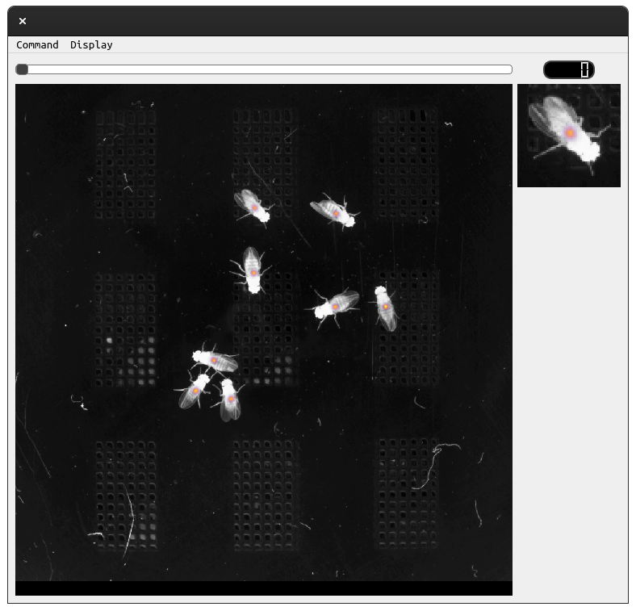

# flysight

Visual display tool for observing heatmaps, peak detections, and frames from
video.



## Running

Configuring your environment.

```bash
make virtualenv
make dep
```

Any subsequent run:

```bash
make run
```

### Dependencies: ubuntu
