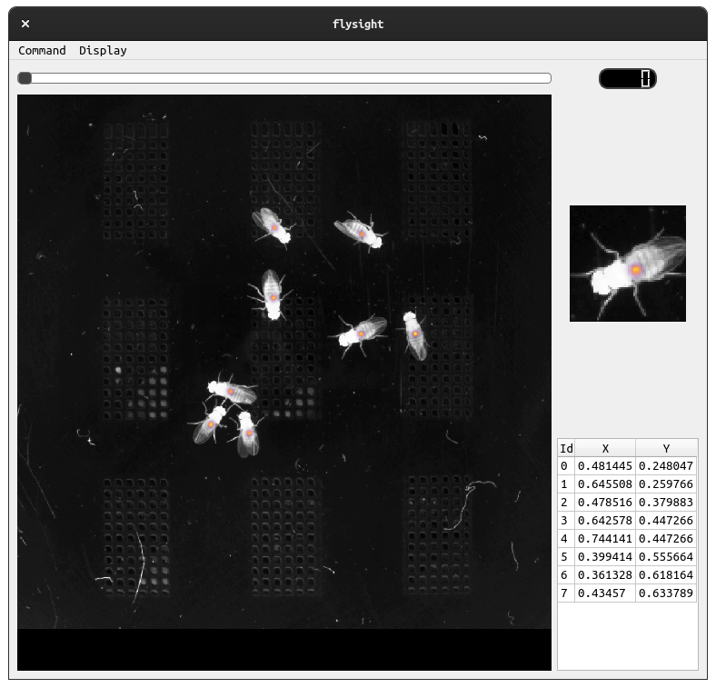

# flysight

Visual display tool for observing heatmaps, peak detections, and frames
from video.



## Build

The recommended way to run this program is through use of the top-level
`Makefile` which internally uses VirtualEnv.

These three commands will configure a virtualenv, install dependencies,
and run the app.

```bash
make virtualenv
make dep
make run
```

*Alternatively*, you can install the package.

```bash
python3 -m venv venv
. venv/bin/activate
python setup.py install
```

Then the command will be available as `flytrack`.

## Running

Configuring your environment.

```bash
make virtualenv
make dep
```

Any subsequently run:

```bash
make run
```

## Data

To fetch the two video examples:

```
cd data
./get.sh
```

### Command

`Open` opens a new video file.

`Save` will save the currently rendered image to disk as a PNG.

`Quit` you can guess.

### Display

`Show Image` requests the renderer to display the raw image from the
provided video stream.

`Show Peaks` requests the renderer to display arrows pointing at the
pixel selected from nonmax-suppression.

`Show Heatmap` requests the renderer to display the heatmap.  If the
image is also shown, it will set an alpha channel such that you can
see the heatmap overlaid on the image.

## Debugging

If you are receiving complaints from `protobuf`, you may need to
generate the protofiles for your system.  This will require you
installing `protoc`.  On ubuntu, `apt-get install protobuf-compiler`.

Then run, `make proto`.
